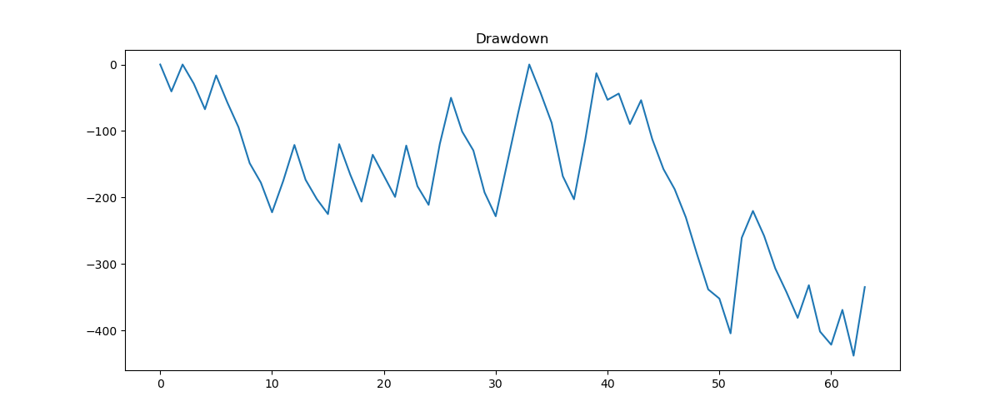

# BankNifty-Weekly-Options-Backtest

A Python-based backtesting project implementing a **BANKNIFTY weekly ATM straddle strategy with 2% OTM protective wings**, using historical NSE Futures & Options data.  
Built strictly as per the **Quant Research Intern Test Assignment**.

---

## 📌 Strategy Summary

- Sell **ATM Call + ATM Put** (weekly expiry) at **10:30 AM**
- Buy **2% OTM Call & Put** as protective wings
- Apply **30% Stop Loss** and **80% Target** (based on ATM straddle premium)
- Exit **all four legs together**
- If SL/Target not hit, exit at **3:20 PM on expiry**
- Starting capital: **₹10,00,000**

---

## 📂 Required Input Data

### BANKNIFTY Futures (`BANKNIFTY_2017_FUTURES.csv`)
**Required Columns:**
Ticker, Date, Time, Open, High, Low, Close, Volume, OI, Contract, Expiry  

Used only to determine **ATM strike at 10:30 AM**.

---

### BANKNIFTY Options (`BANKNIFTY_2017_OPTIONS.csv`)
**Required Columns:**
Ticker, Date, Time, Open, High, Low, Close, Volume, OI, Type (CE/PE), Strike, Expiry, Contract_Weekly, Contract_Monthly  

Rules:
- Only **weekly contracts** used (`Contract_Weekly == "I"`)
- Monthly contracts ignored

---

## ⚙️ Working Approach

1. Combine Date + Time into Datetime
2. Filter weekly options for efficiency
3. Determine ATM strike using futures price
4. Enter 4-leg position (ATM CE, ATM PE, 2% OTM CE, 2% OTM PE)
5. Monitor SL / Target intraday
6. Exit all legs together or at expiry
7. Update capital and log trade

---

## 📈 Generated Graphs

### Equity Curve

### Drawdown Curve

---

## 📑 Performance Statistics (PerformanceStats.csv)

| Metric          | Value      |
|-----------------|------------|
| Total Trades    | 243        |
| Net PnL         | 4,903.60   |
| ROI (%)         | 0.49       |
| Win Rate (%)    | 46.52      |
| Max Drawdown    | -1,734.60  |

---

## 📊 Trade Report Preview (TradeReport.csv)

| Trade Date | Expiry     | ATM | Entry Straddle | Wings Cost | Net Entry | Exit Value | PnL   | Exit Reason | Capital |
|-----------|------------|-----|----------------|------------|-----------|------------|-------|-------------|---------|
| 02-01-2017 | 05-01-2017 | 18200 | 308.95 | 41.20 | 267.75 | 365.30 | -97.55 | STOP_LOSS | 999902.5 |
| 03-01-2017 | 05-01-2017 | 18200 | 255.30 | 38.10 | 217.20 | 11.90 | 205.20 | TARGET | 1000108 |
| 04-01-2017 | 05-01-2017 | 18000 | 177.75 | 29.80 | 147.95 | 72.00 | 75.95 | EXPIRY | 1000183 |

*(Full data available in `TradeReport.csv`)*

---

## 🧪 Libraries Used

Dependencies listed in `requirements.txt`:

pandas  
matplotlib  

---

## ✅ Assignment Compliance Checklist

- ATM weekly straddle at 10:30 AM  
- 2% OTM protective wings included in PnL  
- 30% Stop Loss & 80% Target  
- Expiry exit at 3:20 PM  
- Capital starts at ₹10,00,000  
- Trade report generated  
- Performance stats generated  
- Equity & drawdown plotted  

---

## 📝 Notes

- Deterministic, rule-based backtest
- No discretionary assumptions
- Handles real NSE intraday data issues
- Optimized for large (~585 MB) dataset

---

## 👤 Author

Developed as part of a **Quant Research Intern Test Assignment**  
GitHub: https://github.com/NUCLIE-X
